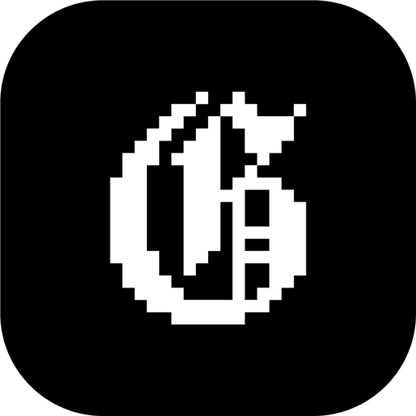

<p align="center">
  
</p>

<h1 align="center">GONE</h1>

<p align="center">
  A player for the thirty minutes before a DJ set<br>
  macOS · Apple Silicon · free and open source
</p>

<p align="center">
  <a href="../../releases/latest"><b>Download</b></a> ·
  <a href="#install">Install</a> ·
  <a href="#build-from-source">Build from source</a> ·
  <a href="#vibe-coded-by-a-designer">How it was made</a>
</p>

---

Your music lives in folders. Your set starts in half an hour. You don't need a library, a sync engine or a beat grid yet; you need to hear what fits.

Drop a folder into GONE. It reads the BPM of every track and sorts the list. Audition candidates at the tempo and EQ of your set, push them through an effect, compare two tracks side by side, keep the ones that work. Then close GONE and open Rekordbox, Serato or your controller.

## What it does

- **Folder in, tempo out.** Drop a folder or a single file; GONE detects BPM, draws the waveform and sorts by tempo
- **Pitch** with three ranges: ±8 % fine, ±16 % medium, ±100 % extreme
- **EQ**: four bands plus high-pass and low-pass, to hear a track the way it will sit in the mix
- **XY pad** with 13 effects: filter, low-pass, high-pass, band-pass, resonance, LFO, BPM chop, slicer, reverb, filtered reverb, delay, dub delay, lo-fi
- **Hot cues** on keys 1–4, and 5–8 for the second player
- **Split Mode**: two independent players and a crossfader for A/B
- **Snap to edge**: the window slides off screen when you don't need it and stays on top when you do
- **Formats**: MP3, WAV, AIFF, FLAC, M4A/AAC, CAF

## What it doesn't do, on purpose

No beat-grid editing, no BPM sync, no MIDI, no library database, no playlist export, no streaming. If a feature belongs in Rekordbox or Serato, it doesn't belong here. GONE is for the half hour before you open those.

## Install

1. Download the latest `.dmg` from [Releases](../../releases/latest)
2. Open it and drag **GONE** into **Applications**
3. Open GONE. The first time, macOS says it can't verify the developer: GONE is shared here on GitHub, not through the App Store, so Apple hasn't notarized it. Allow it once:
   - **macOS 15 and later**: try to open GONE, then go to **System Settings → Privacy & Security**, scroll down and click **Open Anyway**
   - **macOS 13–14**: Control-click GONE in Applications, choose **Open**, then **Open** again
   - **Or in Terminal**: `xattr -dr com.apple.quarantine /Applications/GONE.app`

**Requirements:** a Mac with Apple Silicon (M1 or later), macOS 13 Ventura or later. Runs on macOS 27. Intel Macs can build from source; that path is untested.

Every release lists the SHA-256 of its `.dmg`. To check your download: `shasum -a 256 GONE-*.dmg`

## Build from source

You need Xcode 26 or later. No third-party dependencies: only Apple frameworks (SwiftUI, AppKit, AVFoundation, Accelerate).

```sh
git clone https://github.com/robvagin/gone-player.git
cd gone-player
open GONE.xcodeproj
```

Choose the **GONE** scheme and **My Mac**, then Run. If Xcode asks for a team, pick your own or **Sign to Run Locally** under Signing & Capabilities.

## Vibe-coded by a designer

I'm a designer. I designed this app for myself, then built it with AI agents: I made the decisions, Claude Code wrote most of the Swift. 192 of the first 208 commits are co-authored by Claude. Six weeks passed between the first commit and Beta 1.1.

Nothing is hidden:

- [`CLAUDE.md`](CLAUDE.md): the rules the agents follow, from the fixed audio graph to the list of things they must never touch
- [`docs/`](docs/): briefs, audits, backlog and handoffs between sessions
- [`tools/`](tools/): the audit scripts that checked the code for hangs, memory, performance and regressions

If you want to see how someone who isn't a developer ships a native audio app, it's all here. Take it if you want it.

## Contributing

Issues and pull requests are welcome. Read [What it doesn't do](#what-it-doesnt-do-on-purpose) first: GONE stays small. Issues marked [good first issue](../../labels/good%20first%20issue) are a good place to start.

## License

[MIT](LICENSE) © 2026 Robert Vagin
